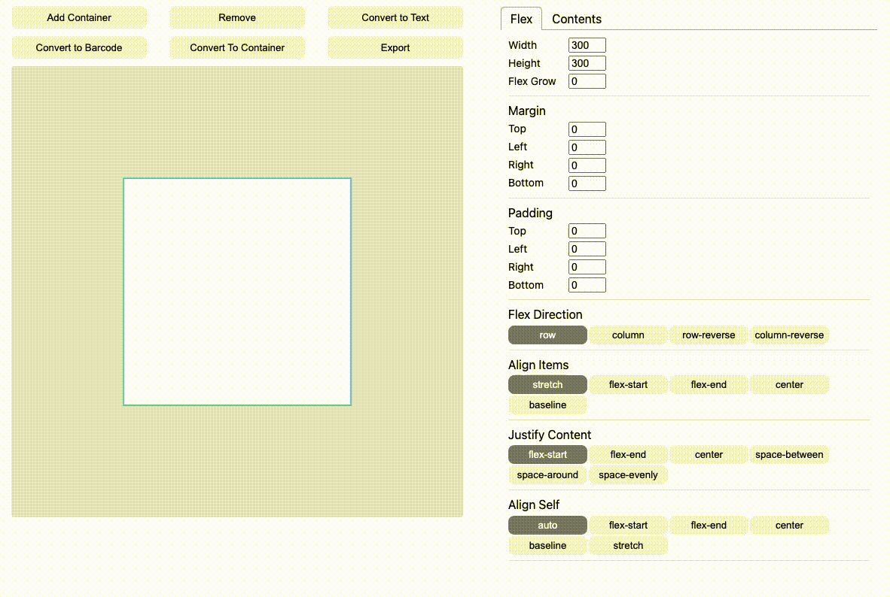

# Barcode Editor

박스히어로 라벨을 GUI로 생성할 수 있도록 이 앱을 개발함. 프로토타입 느낌이라 아직 완벽하지는 않음.

- 이[post](https://medium.com/bgpworks/%EB%B0%94%EC%BD%94%EB%93%9C-%EB%9D%BC%EB%B2%A8-%EC%9D%B8%EC%87%84-%EC%84%9C%EB%B2%84-%EA%B5%AC%ED%98%84%EA%B8%B0-rust-skia-flex-layout-serverless-d81aa7447290)에서 영감을 많이 받음.

- [demo](https://hopeful-hopper-5cd4dd.netlify.app/)

## Stack

- [yoga-layout](https://yogalayout.com/)
- [jsBarcode](https://github.com/lindell/JsBarcode)
- react
- [ramda](https://ramdajs.com/docs/)

## Main Feature

- flex layout
- barcode, text 입력
- 기초적인 drag mode지원(double click으로 동작): 이 기능은 완벽하지는 않다.

